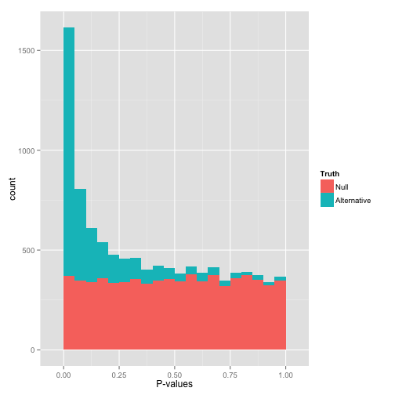

# Finding ifferentially expressed features

## Linear models {#sec-linmod}

The objective of this chapter is to provide students with an intuitive
understanding of how linear models are used in significance testing,
and more specifically

- show how linear models are equivalent to a t-test
- demonstrate their flexibility.

## Starting with a t-test

`r msmbstyle::question_begin()`

Load the `gexp` data from the `rWSBIM2122` package (version >= 0.2.2)
as show below. It provides the log2 expression of a single gene of
interest measured in two groups, namely 1 and 2. Ignore the `ID`
column for now.

```{r gexp}
library(rWSBIM2122)
data(gexp)
gexp
```

Using a t-test, compare the expression in groups 1 and 2. In
particular, report the mean expression of each group, the log2
fold-change, the associated p-value and visualise the data.

`r msmbstyle::question_end()`


`r msmbstyle::solution_begin()`

```{r gexp_t_test1}
t.test(expression ~ group, data = gexp)
```

We set

- $H_0$: the means of the two groups are the same, $\mu_{1} = \mu_{2}$.
- $H_1$: the means of the two groups are different, $\mu_{1} \neq \mu_{2}$.

and calculate a two-sided, two-sample t-test (assuming unequal
variances) with

$$
t = \frac{ \bar X_{1} - \bar X_{2} }
         { \sqrt{ \frac{ s_{1}^{2} }{ N_{1} } + \frac{ s_{2}^{2} }{ N_{2} } } }
$$


where $\bar X_i$, $s_{i}^{2}$ and $N_i$ are the mean, variance and
size of samples 1 and 2.

A t-test has the following assumptions:

- the data are normally distributed;
- the data are independent and identically distributed;
- equal or un-equal (Welch test) variances.

Note that the t-test is robust to deviations[^models].

[^models]: All models are wrong. Some are useful.


```{r gexp_vis1, message = FALSE}
library("ggplot2")
p <- ggplot(gexp, aes(x = group, y = expression)) +
    geom_boxplot() + geom_jitter()
p
```

`r msmbstyle::solution_end()`

## The linear model equivalence


Let's now use linear regression and the `lm()` function to model the
expression in groups 1 and 2:

$$y = \beta_0 + \beta_1 \times x + \epsilon$$

where $y$ is the expression we want to model and $x$ represents the
two groups that are generally encoded as 0 and 1. The expression above
translates as follows:

- the expression in group 1 (i.e. when $x = 0$) is equal to $\beta_0$
  (the average expression of group 1);
- the expression in group 2 (i.e. when $x = 1$) is equal to
  $\beta_0$ + $\beta_1$ (the difference between group 1 and group 2).

We model this with

```{r mod1}
mod1 <- lm(expression ~ group, data = gexp)
mod1
```

An indeed, we see that

1. the intercept corresponds to the mean in group 1, and
2. the slope (`group2` coefficient) of the model corresponds to the
   log2 fold-change and that, as expected, the mean of group 2 is
   *intercept + slope*.

We can visualise this linear model with:

```{r}
p  +
    geom_point(data = data.frame(x = c(1, 2), y = c(2.75, 4.33)),
               aes(x = x, y = y),
               colour = "red", size = 5) +
    geom_abline(intercept = coefficients(mod1)[1] - coefficients(mod1)[2],
                slope = coefficients(mod1)[2])
```

Note that above, we need to subtract the slope from the intercept when
plotting the linear model because groups 1 and 2 are encoded as 0 and
1 in the model, but plotted as 1 and 2 on the figure.

We can also extract the p-value associated with the coefficients:

```{r}
summary(mod1)
```

that are computer as

$$t_{score} = \frac{\beta_i - 0}{SE_{\beta_i}}$$

that has a t-distribution with n − 2 degrees of freedom if the null
hypothesis is true. We use a t-test that tests whether the slope is
different from 0:

- $H_0$: $\beta_i = 0$
- $H_1$: $\beta_i \neq 0$

The p-values for the slope $\beta_1$ is slightly different due to the
homoscedasticity assumption that wasn't set in the t-test, which we
can repeat:


```{r}
t.test(expression ~ group, data = gexp, var.equal = TRUE)
```


## Paired t-test

`r msmbstyle::question_begin()`

The `ID` variable in the `gexp` data provides the unique sample
identifier: it is the sample in which an expression of 2.7 was
measured in group 1 and 3.9 in group 2.

Repeat the test comparing the gene expression between group 1 and
group 2 using a *paired* t-test. Report the mean expression of each
group, the log2 fold-change, the associated p-value and visualise the
data.

Compare the p-values obtained in the paired and unpaired designs and
explain the differences.

`r msmbstyle::question_end()`

`r msmbstyle::solution_begin()`

```{r gexp_t_test2}
t.test(expression ~ group, data = gexp, paired = TRUE)
```

```{r gexp_vis2}
gexp2 <- dplyr::full_join(gexp[1:10, ], gexp[11:20, ],
                          by = "ID", suffix = c("_1", "_2"))

ggplot(gexp, aes(x = group, y = expression)) +
    geom_boxplot() +
    geom_point(aes(colour = ID), size = 4) +
    geom_segment(data = gexp2,
                 aes(x = group_1, xend = group_2,
                     y = expression_1, yend = expression_2,
                     colour = ID))
```

In the unpaired design, the variances in groups 1 and 2 are
`r round(var(gexp2$expression_1), 2)` and
`r round(var(gexp2$expression_2), 2)` respectively,
and do not take into account the paired relation between
samples. Using a paired design allows for a smaller estimation of the
observed variability, leading to a greater t statistic and a smaller
p-value.

`r msmbstyle::solution_end()`

This comparison can be replicated using a linar model[^mod2]

[^mod2]: See below for the exact equation.

$$y = \beta_0 + \beta_1 \times group + \beta_i \times ID_i + \epsilon$$

where the $\beta_i$ coefficients will encode the relation between
pairs of individuals. We model this with

```{r mod2}
mod2 <- lm(expression ~ group + ID, data = gexp)
mod2
```

which corresponds to the following model

```{r, echo = FALSE, results = "asis", eval = FALSE, include = FALSE}
## this has been used to generate the equation below
equatiomatic::extract_eq(mod2, wrap = TRUE, terms_per_line = 4)
## modified \alpha into \beta_{0} manually
```

$$
\begin{aligned}
    \operatorname{expression} &= \beta_{0} + \beta_{1}(\operatorname{group}_{\operatorname{2}}) + \beta_{2}(\operatorname{ID}_{\operatorname{2}}) + \beta_{3}(\operatorname{ID}_{\operatorname{3}})\ + \\
    &\quad \beta_{4}(\operatorname{ID}_{\operatorname{4}}) + \beta_{5}(\operatorname{ID}_{\operatorname{5}}) + \beta_{6}(\operatorname{ID}_{\operatorname{6}}) + \beta_{7}(\operatorname{ID}_{\operatorname{7}})\ + \\
    &\quad \beta_{8}(\operatorname{ID}_{\operatorname{8}}) + \beta_{9}(\operatorname{ID}_{\operatorname{9}}) + \beta_{10}(\operatorname{ID}_{\operatorname{10}}) + \epsilon
\end{aligned}
$$

The `group2` coefficient still corresponds to the fold-change between
the two groups. The coefficients `ID2` to `ID10` correspond to the
respective differences between the average expression of `ID1` and
`ID2` to `ID10`.

```{r}
avg_id <- (gexp2$expression_1 + gexp2$expression_2)/2
coefs_id <- avg_id[-1] - avg_id[1]
names(coefs_id) <- paste0("ID", 2:10)
coefs_id
```

As above, a summary of the model will give us the statistical
significance for the different coefficients.

```{r}
summary(mod2)
```

`r msmbstyle::question_begin()`

Interpret the summary of `mod2` computed above.

`r msmbstyle::question_end()`

`r msmbstyle::solution_begin()`

We see that the `group2` coefficient, that tests the difference
between the two groups is now significant. It is identical to the
paired t-test above.


The respective ID coefficients compare the average expression in these
IDs against the average expression of ID1. We can indeed see that ID6
and ID7, that have significant coefficients, are the most different
from ID1.

`r msmbstyle::solution_end()`

## Model generalisation

In the example above, we had two variables that influenced the gene
expression, namely the group and the specific individual and we ended
up with a model that included both of these[^tilda]:

[^tilda]: We will drop the left-hand side term of our formula, setting
    it by default as the quantiative expression data.


```{r, eval = FALSE}
~ group + ID
```

Any additional variables could be added to the model if deemed
necessary.


`r msmbstyle::question_begin()`

We have measured the gene expression in cell lines U2OS and Jurkat
(defined as variable `cell_line`), each in the presence of drug A or B
(defined as variable `drug`). How would you define the model formula?

`r msmbstyle::question_end()`

`r msmbstyle::question_begin()`

As above, we have measured the gene expression in cell lines U2OS and
Jurkat (defined as variable `cell_line`), each in the presence of drug
A or B (defined as variable `drug`). This time however, two operators
(defined as variable `operator`) have shared the work. How would you
define the model formula?

`r msmbstyle::question_end()`


## Interactions between variables

Consider the following design: two plant genotypes, wild type and a
mutant that shows some resistance to drought, that are grown,
collected and analysed by RNA sequencing under normal, humid and dry
conditions. The researchers that set up this experiment expect that
the two genotypes will produce, for some key genes, different or even
opposite responses in the extreme conditions: that the expression of
some genes will increase in the mutant under dry conditions while they
will decrease (or change to a lesser extend at least) under humid
conditions.

```{r, echo = FALSE}
des <- data.frame(sample = 1:12,
                  genotype = rep(c("WT", "MT"), each = 6),
                  condition = rep(c("normal", "dry", "humid"), 4))
DT::datatable(des, rownames = FALSE,
              class = 'cell-border stripe',
              options = list(
                  pageLength = 12,
                  autoWidth = TRUE))
```

Such situation require a new model formula syntax

```{r, eval = FALSE}
~ genotype * condition
```

which is equivalent to

```{r, eval = FALSE}
~ genotype + condition + genotype * condition
```

Here, coefficients are estimated for `genotype`, `condition` and the
**interaction** between the two, and the model will test for
differences in *condition* slopes between the different
genotypes. These differences might even culminate in opposite signs.

## Exercise

`r msmbstyle::question_begin()`

Load the `lmdata` data available in the `rWSBIM2122` package (version
0.2.2 or later), that provides two variables, `lmdata` and `lmannot`,
describing a factorial design (2 factors, `condition` and `cell_type`
with 2 levels each) with gene expression for 5 genes and 12 samples.

```{r}
data(lmdata, package = "rWSBIM2122")
lmdata
lmannot
```

Analyse each gene with a linear model, defining an appropriate model
formula, and interpret the results for each gene. You can visualise
the data to help with the interpretation.

`r msmbstyle::question_end()`


`r msmbstyle::solution_begin()`

```{r, message = FALSE}
library("tidyverse")
## Prepare the data
x <-
    data.frame(lmdata) %>%
    rownames_to_column() %>%
    pivot_longer(names_to = "sample", values_to = "expression", -rowname) %>%
    full_join(lmannot) %>%
    mutate(sample = sub("sample_", "", sample))
```

```{r}
## Analyse gene 1
x_i <- filter(x, rowname == "gene_1")
x_i
mod_i <- lm(expression ~ condition * cell_type, data = x_i)
summary(mod_i)

ggplot(x_i, aes(x = sample, y = expression,
                colour = condition,
                shape = cell_type)) +
    geom_point()
```

```{r}
## Analyse gene 2
x_i <- filter(x, rowname == "gene_2")
x_i
mod_i <- lm(expression ~ condition * cell_type, data = x_i)
summary(mod_i)

ggplot(x_i, aes(x = sample, y = expression, colour = cell_type)) +
    geom_point() +
    facet_wrap(~ condition)
```

```{r}
## Analyse gene 3
x_i <- filter(x, rowname == "gene_3")
x_i
mod_i <- lm(expression ~ condition * cell_type, data = x_i)
summary(mod_i)

ggplot(x_i, aes(x = sample, y = expression, colour = condition)) +
    geom_point() +
    facet_wrap(~ cell_type)
```

```{r}
## Analyse gene 4
x_i <- filter(x, rowname == "gene_4")
x_i
mod_i <- lm(expression ~ condition * cell_type, data = x_i)
summary(mod_i)

ggplot(x_i, aes(x = sample, y = expression,
                colour = condition,
                shape = cell_type)) +
    geom_point()
```


```{r}
## Analyse gene 5
x_i <- filter(x, rowname == "gene_5")
x_i
mod_i <- lm(expression ~ condition * cell_type, data = x_i)
summary(mod_i)

group_by(x_i, cell_type, condition) %>% summarise(mean = mean(expression))
group_by(x_i, cell_type) %>% summarise(mean = mean(expression))
group_by(x_i, condition) %>% summarise(mean = mean(expression))

ggplot(x_i, aes(x = sample, y = expression,
                colour = condition,
                shape = cell_type)) +
    geom_point() +
    facet_grid(cell_type ~ condition)
```

`r msmbstyle::solution_end()`


## Which model to use?

The same experimental design can be analysed using different
models. Some are clearly not appropriate, such as the omission of the
ID variable in the first example. Other cases aren't that clear.

- If we return to the previous example for gene 3, we see that in both
  cases, we obtain significant results for the cell type coefficient,
  albeit with a much smaller p-value in the simpler model.


```{r}
x_i <- filter(x, rowname == "gene_3")
summary(lm(expression ~ condition + cell_type, data = x_i))
summary(lm(expression ~ condition * cell_type, data = x_i))
```

The questions asked is slighly different. The coefficient `cell_typeB`
in the model without interaction tests for shared differences in the
two cell types by taking into account that there are two
conditions. In the model with interaction, the test focuses in the
cell type effect in the reference condition only.

- If we look at gene 5, we see that we miss out several significant
  effects if we use the simpler model, without interaction, because
  the simpler model doesn't ask the right question.


```{r}
x_i <- filter(x, rowname == "gene_5")
summary(lm(expression ~ condition + cell_type, data = x_i))
summary(lm(expression ~ condition * cell_type, data = x_i))
```

In high throughput experiments, where we test tens of thousands of
genes, we thus can't explore each gene separately with multiple
models. The same model is applied to all genes and the significance of
coefficient(s) of interest is/are considered.

Solving this dilema isn't a statistical but a scientific question. You
will have to define the hypothesis that underlies the
experiment[^hypo]. If there are reasons to believe that an interaction
effect is relevant (i.e. there are different effects in the two cell
types), then the more complex model (with an interaction) is
appropriate. If no such interaction is expected, then testing for it
penalises your analysis. In other words it isn't the complexity of the
model that makes its quality, but its appropriateness for the studied
design/effect.

[^hypo]: ideally even before generating any data.

Accumulating models and tests isn't necessarily a solution either, as
this leads to the accumulation of tests that would require additional
adjustment for multiple testing.

## Testing many features

Let's now use the `tdata1` dataset from the `rWSBIM1322` package that
provide gene expression data for 100 genes and 6 samples, three in
group A and 3 in group B.

```{r}
library("rWSBIM1322")
data(tdata1)
log_tdata1 <- log2(tdata1)
head(log_tdata1)
```

```{r}
limma::plotDensities(log_tdata1)
```

We are now going to apply a t-test to feature (row) 73, comparing the
expression intensities in groups A and B. As we have seen, this can be
done with the `t.test` function:


```{r}
x <- log_tdata1[73, ]
t.test(x[1:3], x[4:6])
```

`r msmbstyle::question_begin()`

We would now like to repeat the same analysis on the 100 genes.

- Write a function that will take a vector as input and perform a
  t-test of the first values (our group A) against the 3 last values
  (our group B) and returns the p-values.

- Apply the test to all the genes.

- How many significantly differentically expressed genes do you find?
  What features are of possible biological interest?

`r msmbstyle::question_end()`


`r msmbstyle::solution_begin()`
```{r}
my_t_test <- function(x) {
    t.test(x[1:3], x[4:6])$p.value
}
pvals <- apply(log_tdata1, 1, my_t_test)
table(pvals < 0.05)
head(sort(pvals))
```
`r msmbstyle::solution_end()`


`r msmbstyle::question_begin()`
The data above have been generated with the `rnorm` function for all
samples.

- Do you still think any of the features show significant differences?

- Why are there still some features (around 5%) that show a
  significant p-value at an alpha of 0.05?

`r msmbstyle::question_end()`


To answer these questions, let's refer to [this xkcd
cartoon](https://xkcd.com/882/) that depicts scientists testing
whether eating jelly beans causes acne.


```{r, results='markup', fig.cap="Do jelly beans cause acne? Scientists investigate. From [xkcd](https://xkcd.com/882/).", echo=FALSE, purl=FALSE, fig.align='center'}
knitr::include_graphics("./figs/jellybeans.png")
```

The data that was used to calculate the p-values was all drawn from the same distribution $N(10, 2)$.

As a result, we should not expect to find a statistically significant
result, unless we repeat the test enought times. Enough here depends
on the $\alpha$ we set to control the type I error. If we set $\alpha$
to 0.05, we accept that rejecting $H_{0}$
in 5% of the extreme cases where we shouldn't reject it. This is an
acceptable threshold that however doesn't hold when we repeat the test
many time.


An important visualistion when performing statistical test repeatedly,
is to visualise the distribution of computed p-values. Below, we see
the histogram of the `tdata1` data and 100 values drawn from a uniform
distribution between 0 and 1. Both are very similar; they are flat.


```{r pvalhist, fig.cap = "Distribution of p-values for the `tdata1` dataset (left) and 100 (p-)values uniformely distributed between 0 and 1 (right)."}
par(mfrow = c(1, 2))
hist(pvals)
hist(runif(100))
```

Below we see the expected trends of p-values for different
scenarios. This example comes from the [Variance
explained](http://varianceexplained.org/statistics/interpreting-pvalue-histogram/).

```{r pvalhists2, results='markup', fig.cap="Expected trends of p-values for different scenarios ([source](http://varianceexplained.org/statistics/interpreting-pvalue-histogram/)).", echo=FALSE, purl=FALSE, fig.align='center', out.width='100%', fig.align='center'}
knitr::include_graphics("./figs/plot_melted-1.png")
```

In an experiment with enough truly differentially expression features,
on expects to observe a substantial increase of small p-values
(anti-conservative). In other words, we expect to see more small
p-values that at random, or when no statistically significant are
present (uniform). All other scenarios warrant further inspection, as
they might point to issue with the data of the tests.

When many tests are preformed, the p-values need to be *adjusted*, to
take into account that many tests have been performed.

## Adjustment for multiple testing

There are two classes of multiple testing adjustment methods:

- **Family-wise error rate** (FWER) that gives the probability of one
  or more false positives. The **Bonferroni correction** for *m* tests
  multiplies each p-value by *m*. One then checks if any results still
  remains below significance threshold.

- **False discovery rate** (FDR) that computes the expected fraction
  of false positives among all discoveries. It allows us to choose *n*
  results with a given FDR. Widely used examples are
  Benjamini-Hochberg or q-values.


The figure below illustrates the principle behind the FDR
adjustment. The procedure estimate the proportion of hypothesis that
are null and then adjust the p-values accordingly.

```{r fdrhist, results='markup', fig.cap="Principle behind the false discovery rate p-value adjustment ([source](http://varianceexplained.org/statistics/interpreting-pvalue-histogram/)).", echo=FALSE, purl=FALSE, fig.align='center', out.width='100%', fig.align='center'}

```

Back to our `tdata1` example, we need to take this into account and
adjust the p-values for multiple testing. Below we apply the
Benjamini-Hochberg FDR procedure using the `p.adjust` function and
confirm that none of the features are differentially expressed.

```{r}
adj_pvals <- p.adjust(pvals, method = "BH")
```

`r msmbstyle::question_begin()`
Are there any adjusted p-values that are still significant?
`r msmbstyle::question_end()`


`r msmbstyle::solution_begin()`
```{r}
any(adj_pvals < 0.05)
min(adj_pvals)
```
`r msmbstyle::solution_end()`
