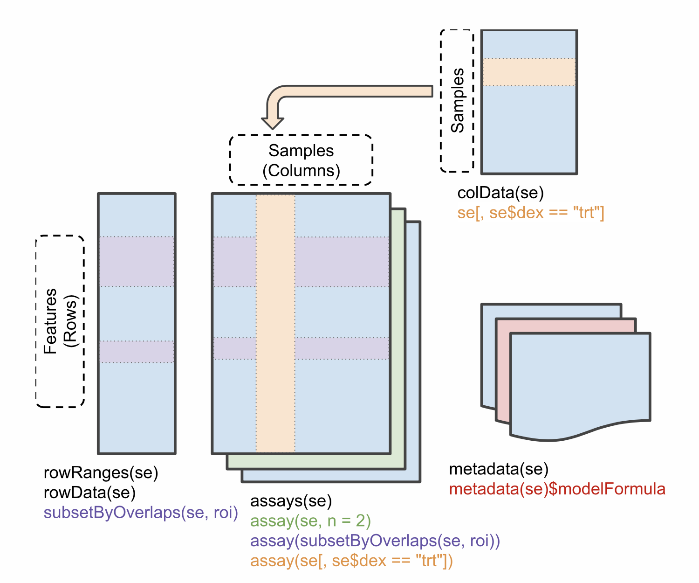

# SummarizedExperiments

```{r, echo = FALSE, message = FALSE}
library("tidyverse")
```

**Objectives**

- Present the `SummarizedExperiment` class, extensively used in omics
  analyses.
- Show how to build `SummarizedExperiment` objects.

Data in bioinformatics is often more complex than the basic data types
we have seen so far. To deal with this, developers define specialised
data containers (termed classes) that match the properties of the data
they need to handle.

This aspect is central to the **Bioconductor**[^Bioconductor] project
which uses the same **core data infrastructure** across packages. This
certainly contributed to Bioconductor's success. Bioconductor package
developers are advised to make use of [existing
infrastructure](https://uclouvain-cbio.github.io/WSBIM1322/sec-obj.html#examples-from-the-bioconductor-project)
to provide coherence, interoperability and stability to the project as
a whole.

[^Bioconductor]:The [Bioconductor](http://www.bioconductor.org) was
initiated by Robert Gentleman, one of the two creators of the R
language. Bioconductor provides tools for the analysis and
comprehension of omics data.  Bioconductor uses the R statistical
programming language, and is open source and open development.

To illustrate such an omics data container, we'll present the
`SummarizedExperiment` class.

## SummarizedExperiment

The figure below represents the anatomy of SummarizedExperiment.

```{r SE,  echo=FALSE, out.width = '80%'}

```

Objects of the class SummarizedExperiment contain :

- **One (or more) assay(s)** containing the quantitative omics data
  (expression data), stored as a matrix-like object. Features (genes,
  transcripts, proteins, ...) are defined along the rows and samples
  along the columns.

- A **sample metadata** slot containing sample co-variates, stored as a
  data frame. Rows from this table represent samples (rows match exactly the
  columns of the expression data). Columns from this table represent sample
  covariates along the columns.

- A **feature metadata** slot containing feature co-variates, stored as
  data frame. The rows of this dataframe's match exactly the rows of the
  expression data.

The coordinated nature of the high throughput data guarantees that the
dimensions of the different slots will always match (i.e the columns
in the expression data and then rows in the sample metadata, as well
as the rows in the expression data and feature metadata) during data
manipulation.

The metadata slots can grow additional co-variates (columns) without
affecting the other structures.

### Creating a SummarizedExperiment

Let's return to the `rna` dataset that we have used previously.

```{r , message = FALSE}
rna <- read_csv("data/rnaseq.csv")
rna
names(rna)
```

In this table, we can find gene expression per gene and per sample, as well as
columns describing the samples (orgnanism, age, sex...), and columns describing
the genes (ENTREZID, product, chromosome_name, gene_biotype...)

We will convert this table in a `SummarizedExperiment`.
To do so we will extract from this table:

- A count matrix that will be used as the **`assay`**

- A table describing the samples that will be used as the **sample metadata** slot

- A table describing the genes that will be used as the **features metadata** slot

**count matrix**

```{r}
counts <- rna %>%
  select(gene, sample, expression) %>%
  pivot_wider(names_from = sample,
              values_from = expression)

count_matrix <- counts %>% select(-gene) %>% as.matrix()
rownames(count_matrix) <- counts$gene

count_matrix[1:5, ]
```

**table describing the samples**

```{r}
sample_metadata <- rna %>%
  select(sample, organism, age, sex, infection, strain, time, tissue, mouse)

# Many lines are repeated, as in rna, each gene (n = 1474) was analysed in each sample!
sample_metadata

# Remove redundancy
sample_metadata <- unique(sample_metadata)
sample_metadata
```

**table describing the genes**

```{r}
gene_metadata <- rna %>%
  select(gene, ENTREZID, product, ensembl_gene_id, external_synonym, chromosome_name, gene_biotype, phenotype_description, hsapiens_homolog_associated_gene_name)

# Remove redundancy
gene_metadata <- unique(gene_metadata)
gene_metadata
```


We can now put the different parts together using the
`SummarizedExperiment` constructor:

```{r, message = FALSE}
#BiocManager::install("SummarizedExperiment")
library("SummarizedExperiment")
```

```{r}
se <- SummarizedExperiment(assays = count_matrix,
                           colData = sample_metadata,
                           rowData = gene_metadata)
se
```

Using this data structure, we can access the expression matrix with
the `assay` function, the feature metadata with the `rowData` function,
and the sample metadata with the `colData` function:


```{r}
dim(assay(se))
head(assay(se))
```

```{r}
colData(se)
```

```{r}
dim(rowData(se))
head(rowData(se))
```

#### Adding variables to metadata

We can also add information to the metadata.
Suppose that you want to add the center where the samples were collected...

```{r}
colData(se)$center <- rep("University of Illinois", nrow(colData(se)))
colData(se)
```

This illustrates that the metadata slots can grow indefinitely without affecting
the other structures!


### Subsetting a SummarizedExperiment

SummarizedExperiment can be subset just like with data frames,
with numerics or with characters of logicals.

Below, we create a new instance of class SummarizedExperiment that contains only
the 5 first features for the 3 first samples.

```{r}
se1 <- se[1:5, 1:3]
se1
```

We can also use the colData() function to subset on something from the sample metadata.
For example, here we keep only the non infected samples.

```{r}
se1 <- se[, colData(se)$infection == "NonInfected"]
se1
colData(se1)
```

Of course the rowData() function can similarly be used to keep only certain
features of interest. We could for example focus on miRNAs...

```{r}
se1 <- se[rowData(se)$gene_biotype == "miRNA",]
se1
assay(se1)
```


`r msmbstyle::question_begin()`

Extract the gene expression levels of the 3 first genes in sample at time 0 and at time 8.

`r msmbstyle::question_end()`

`r msmbstyle::solution_begin()`

```{r, purl=FALSE}
assay(se)[1:3, colData(se)$time != 4]

# Equivalent to
assay(se)[1:3, colData(se)$time == 0 | colData(se)$time == 8]
```
`r msmbstyle::solution_end()`

## RangedSummarizedExperiment

In addition to the `SummarizedExperiment` slots we have seen above, it
is also possible to store information about the features' genomic
ranges. Below, we load the `airway` `RangedSummarizedExperiment` data
to illustrate this:


```{r load_airway}
library(airway)
data(airway)
airway
```

```{r rowRanges}
rowRanges(airway)
```


This `GRangesList` contains a list of 64102 range elements, one for
each gene/feature. Each element is a `GRanges` object that contains
the positions of the exons or the genes:


```{r rowRanges1}
rowRanges(airway)[[1]]
```

It is possible to use these row genomic ranges to subset features in
regions of interest, defined as `GRanges` object. Below, for example,
we subset features between bases 1M and 2M on chromosome 7:


```{r subsetByOverlaps}
roi <- GRanges(seqnames = "7", ranges = 1e6:2e6)
subsetByOverlaps(airway, roi)
```


## Creating a count matrix from multiple files

Raw HTS fastq files from different sample are processed into raw
counts one by one (see next chapter). These data meed to be merged in
a single count matrix, were each column represents a sample, and each
line represents a gene. This count matrix will be the starting point
of a differential expression analysis.

```{r, echo = FALSE}
load("wsbim2122_data/deseq2/counts.rda")
head(counts)
```

`r msmbstyle::question_begin()`

Imagine you had initially 6 samples (3 control and 3 treated samples)
that you have processed independently giving the 6 counts files
generated by FeatureCounts located in the folder
`wsbim_data/count_data/`.


```{r}
samples <- list.files("wsbim2122_data/count_data",
                      pattern = "*tsv.gz",
                      full.names = TRUE)
samples
```

Use these files to create a count matrix.

`r msmbstyle::question_end()`

`r msmbstyle::solution_begin()`

```{r make_counts_1, message = FALSE}
counts <- read_tsv(samples[1]) %>%
    select(Geneid, ends_with('.bam'))

for (sample in samples[-1]){
  tmp <- read_tsv(sample) %>%
      select(ends_with('.bam'))
  counts <- cbind(counts, tmp)
}

names(counts) <- sub(pattern = ".bam$", '', names(counts))
names(counts) <- sub(pattern = "../processed_data/bam/", '', names(counts))
head(counts)
```

```{r make_counts_2}
## We want the 7th column from each file
sapply(samples, function(x) names(read.delim(x)))

## Create the counts matrix
counts <- sapply(samples, function(x) read.delim(x)[, 7])

## Update row/col names
rownames(counts) <- read.delim(samples[1])[[1]]
colnames(counts) <- paste0(sample, 1:ncol(counts))
head(counts)
```

`r msmbstyle::solution_end()`
